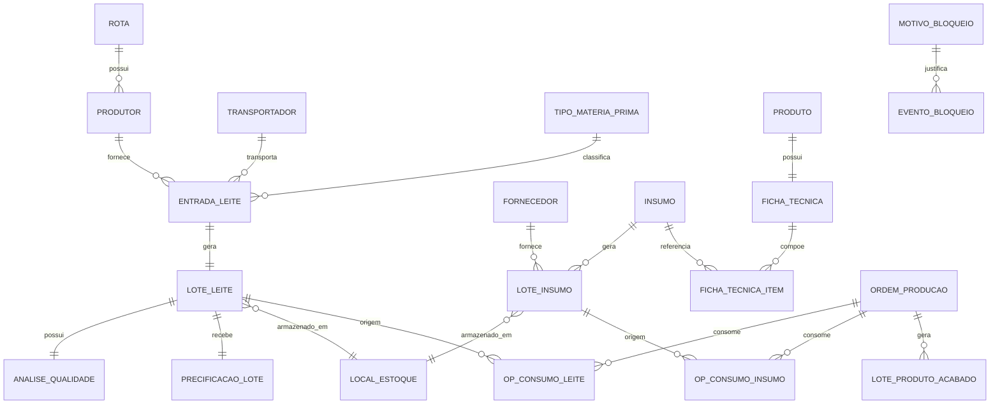

# Especificação Funcional - Cadastros Base para Estoque e Lotes

## 1. Visão Geral

Esta funcionalidade define os cadastros mestres necessários para operar o módulo de Lotes e Estoque do MVP da UNA Laticínios, garantindo rastreabilidade, controle de qualidade, validade, composição, custo e vínculo com produção.

O módulo deve sustentar três frentes principais:

1. Recepção e qualificação do leite cru por produtor, rota e transportador.
2. Controle de insumos e produtos acabados por lote, validade, local de estoque e custo.
3. Rastreabilidade completa entre origem, consumo em Ordem de Produção (OP) e estoque resultante.

## 2. Objetivo

Disponibilizar os cadastros base que permitam:

- registrar entradas de leite cru com origem, qualidade e precificação;
- registrar entradas de insumos com validade, lote e fornecedor;
- cadastrar produtos acabados e suas fichas técnicas;
- suportar cálculo de custo, bloqueio de lotes, FEFO, validade e rastreabilidade;
- viabilizar o uso dessas informações nos módulos de recepção, análise laboratorial, produção, folha do leite, estoque e relatórios.

## 3. Escopo da Funcionalidade

### 3.1 Escopo funcional

O escopo contempla:

- CRUD dos cadastros base;
- ativação/inativação de registros;
- vínculos entre entidades mestre e lotes;
- parâmetros de qualidade e precificação;
- parâmetros de validade, localização e bloqueio;
- regras para uso desses cadastros em novas operações;
- dados mínimos para o MVP operar os fluxos de entrada, análise, lote, produção e folha do leite.

### 3.2 Decisões de escopo para o MVP

Para eliminar ambiguidades entre as listas originais, o MVP adotará as seguintes decisões:

1. `Cadastro de Unidades de Medida` entra no MVP como dependência obrigatória de insumos, matéria-prima e produtos acabados.
2. `Cadastro de Tipos de Leite / Matéria-prima` entra no MVP com catálogo inicial mínimo, contendo pelo menos `Leite Cru Refrigerado`.
3. A primeira versão pode entregar `Cadastro de Tipos de Matéria-prima` como parametrização simples, sem necessidade de fluxo avançado multi-matéria-prima.
4. Exclusão física de registros não será permitida após qualquer movimentação; o padrão será inativação lógica.

## 4. Requisitos Funcionais Gerais

### 4.1 Requisitos transversais

- Todo cadastro deve permitir criar, editar, listar, visualizar detalhes e inativar.
- Apenas registros ativos podem ser utilizados em novas operações.
- Toda entidade relacionada a lote deve manter histórico mínimo de criação, alteração de status e vínculo com movimentações.
- Todo lote deve armazenar origem, data de entrada, quantidade inicial, quantidade disponível, status e local de estoque.
- Todo bloqueio de lote deve registrar motivo, usuário e data/hora do evento.
- Validade e bloqueio automático devem ser processados por regras do sistema.

### 4.2 Requisitos de rastreabilidade

- Todo lote de leite cru deve ser rastreável até produtor, rota, transportador, análise e precificação.
- Todo lote de insumo deve ser rastreável até fornecedor e local de estoque.
- Todo lote de produto acabado deve ser rastreável até OP, lotes de leite e lotes de insumos consumidos.
- O sistema deve manter saldo disponível por lote, mesmo após uso parcial.

## 5. Telas Necessárias

## 5.1 Telas do MVP

1. Cadastro de Produtores
2. Cadastro de Rotas de Coleta
3. Cadastro de Transportadores
4. Cadastro de Tipos de Matéria-prima
5. Cadastro de Parâmetros de Qualidade do Leite
6. Cadastro de Regras de Precificação do Leite
7. Cadastro de Insumos
8. Cadastro de Fornecedores
9. Cadastro de Produtos Acabados
10. Cadastro de Ficha Técnica do Produto
11. Cadastro de Lotes de Insumos
12. Cadastro de Motivos de Bloqueio
13. Cadastro de Unidades de Medida
14. Cadastro de Locais de Estoque

### 5.2 Padrão esperado das telas

Cada tela de cadastro deve conter:

- listagem com busca e filtros;
- ação de novo cadastro;
- edição;
- visualização de detalhes;
- status ativo/inativo;
- bloqueio de exclusão quando houver movimentação;
- mensagens claras de validação;
- paginação ou rolagem para listas extensas.

## 6. Especificação dos Cadastros

## 6.1 Cadastro de Produtores

### Descrição

Cadastro dos produtores de leite que fornecem matéria-prima para a UNA Laticínios.

### Campos

| Campo | Tipo | Obrigatório | Regra |
|---|---|---:|---|
| Código do produtor | texto curto | Sim | Único |
| Nome do produtor | texto | Sim | Nome/Razão |
| CPF ou CNPJ | texto | Sim | Único, com máscara e validação |
| Nome da fazenda/propriedade | texto | Sim | Identificação operacional |
| Rota de coleta padrão | referência para rota | Não | Apenas rota ativa |
| Telefone | texto | Sim | Formato válido |
| E-mail | texto | Não | Formato válido |
| Endereço | texto longo | Não | Endereço principal |
| Dados bancários | grupo de campos | Não | Banco, agência, conta, chave PIX |
| Status | enum | Sim | Ativo/Inativo |
| Observações | texto longo | Não | Livre |

### Regras de negócio

- Apenas produtores ativos podem ser selecionados na entrada de leite.
- Cada entrada de leite deve ter exatamente um produtor.
- O produtor é referência obrigatória para folha do leite e histórico de entregas.
- Um produtor pode estar associado a uma rota padrão, mas a entrada deve gravar a rota efetivamente usada no momento do recebimento.

### Validações

- CPF/CNPJ deve ser válido e não duplicado.
- Código do produtor não pode repetir.
- Ao inativar, o sistema deve impedir novas entradas vinculadas ao produtor.

### Critérios de aceite

- Permitir cadastrar, editar, listar e inativar produtor.
- Impedir seleção de produtor inativo na entrada de leite.
- Exibir produtor em recepção de leite, folha do leite e relatórios.

## 6.2 Cadastro de Rotas de Coleta

### Descrição

Cadastro das rotas ou linhas de coleta usadas na captação do leite.

### Campos

| Campo | Tipo | Obrigatório | Regra |
|---|---|---:|---|
| Código da rota | texto curto | Sim | Único |
| Nome da rota | texto | Sim | Identificação amigável |
| Região | texto | Não | Macroárea/município |
| Motorista padrão | texto | Não | Valor informativo |
| Transportador padrão | referência para transportador | Não | Apenas ativo |
| Produtores vinculados | lista de produtores | Não | Apenas ativos |
| Status | enum | Sim | Ativa/Inativa |

### Regras de negócio

- Uma rota pode conter vários produtores.
- Um produtor possui no MVP uma rota padrão ativa por vez.
- Rotas inativas não aparecem para novas entradas.
- A entrada de leite pode registrar rota e produtor mesmo que o vínculo padrão tenha sido alterado depois.

### Validações

- Código da rota deve ser único.
- Não permitir vincular produtor inativo à rota.
- Não permitir selecionar transportador inativo como padrão.

### Critérios de aceite

- Permitir criar, editar, listar e inativar rotas.
- Permitir vincular produtores à rota.
- Exibir a rota na entrada de leite cru.

## 6.3 Cadastro de Transportadores

### Descrição

Cadastro dos transportadores responsáveis pela movimentação de leite cru e produtos acabados.

### Campos

| Campo | Tipo | Obrigatório | Regra |
|---|---|---:|---|
| Nome ou razão social | texto | Sim | Identificação principal |
| CPF/CNPJ | texto | Sim | Único e válido |
| Motorista responsável | texto | Não | Pode variar por operação |
| Placa do veículo | texto | Não | Formato padrão Mercosul aceito |
| Tipo de veículo | enum/texto | Não | Ex.: tanque, baú refrigerado |
| Capacidade do tanque ou baú | número decimal | Não | Maior que zero |
| Telefone | texto | Não | Formato válido |
| Status | enum | Sim | Ativo/Inativo |

### Regras de negócio

- Apenas transportadores ativos podem ser usados em recepção de leite e expedição.
- O transportador deve ser registrado na movimentação para rastreabilidade do lote.

### Validações

- CPF/CNPJ não pode repetir.
- Capacidade, quando informada, deve ser positiva.

### Critérios de aceite

- Permitir cadastrar e listar transportadores.
- Exibir transportador na entrada de leite.
- Exibir transportador na expedição.

## 6.4 Cadastro de Tipos de Matéria-prima

### Descrição

Cadastro dos tipos de matéria-prima recebidos pela indústria.

### Campos

| Campo | Tipo | Obrigatório | Regra |
|---|---|---:|---|
| Nome do tipo de matéria-prima | texto | Sim | Único entre ativos |
| Unidade de medida padrão | referência para unidade | Sim | Obrigatória |
| Prazo máximo de uso | número inteiro | Sim | Em horas ou dias |
| Unidade do prazo | enum | Sim | Horas/Dias |
| Temperatura ideal de recepção | número decimal | Não | Celsius |
| Temperatura máxima permitida | número decimal | Sim | Celsius |
| Status | enum | Sim | Ativo/Inativo |

### Regras de negócio

- O MVP deve sair com `Leite Cru Refrigerado` previamente cadastrado.
- A temperatura máxima deve acionar alerta ou bloqueio conforme parametrização de qualidade.
- O prazo máximo de uso deve alimentar a data limite de utilização do lote.

### Validações

- Temperatura máxima não pode ser menor que a ideal quando ambas existirem.
- Prazo máximo de uso deve ser maior que zero.

### Critérios de aceite

- Existir pelo menos o tipo `Leite Cru Refrigerado`.
- Permitir uso do tipo na entrada de leite.
- Permitir configurar temperatura ideal e limite.

## 6.5 Cadastro de Parâmetros de Qualidade do Leite

### Descrição

Cadastro configurável dos parâmetros laboratoriais usados na aprovação, alerta e bloqueio dos lotes de leite cru.

### Campos

| Campo | Tipo | Obrigatório | Regra |
|---|---|---:|---|
| Nome do parâmetro | texto | Sim | Único |
| Tipo de dado | enum | Sim | Número, Texto, Aprovado/Reprovado |
| Unidade de medida | referência para unidade ou texto | Não | Ex.: %, °D, UFC/mL |
| Valor mínimo permitido | número/texto | Não | Aplicável a parâmetro numérico |
| Valor máximo permitido | número/texto | Não | Aplicável a parâmetro numérico |
| Obrigatório | booleano | Sim | Sim/Não |
| Bloqueia lote automaticamente | booleano | Sim | Sim/Não |
| Status | enum | Sim | Ativo/Inativo |

### Parâmetros iniciais do MVP

- Gordura %
- Proteína %
- Acidez
- CBT
- CCS
- Crioscopia
- Densidade
- Alizarol
- Antibiótico
- Temperatura

### Regras de negócio

- `Alizarol = Reprovado` bloqueia o lote automaticamente.
- `Antibiótico = Detectado` bloqueia o lote automaticamente.
- Parâmetros fora do limite podem gerar alerta ou bloqueio conforme configuração.
- Gordura e proteína devem ficar disponíveis para precificação e análise de rendimento.

### Validações

- Em parâmetros numéricos, ao menos um limite deve ser informado quando o parâmetro for obrigatório.
- Valor mínimo não pode ser maior que valor máximo.
- Parâmetro inativo não deve ser exigido em novas análises.

### Critérios de aceite

- Permitir cadastrar parâmetros.
- Permitir validar análise laboratorial com base nos parâmetros.
- Alterar status do lote automaticamente quando houver parâmetro bloqueante.

## 6.6 Cadastro de Regras de Precificação do Leite

### Descrição

Cadastro das regras vigentes para cálculo do custo do leite por litro no momento da entrada.

### Campos

| Campo | Tipo | Obrigatório | Regra |
|---|---|---:|---|
| Nome da regra | texto | Sim | Identificação única |
| Início da vigência | data | Sim | Obrigatório |
| Fim da vigência | data | Sim | Obrigatório |
| Preço base por litro | moeda | Sim | Maior que zero |
| Bônus por gordura | estrutura configurável | Não | Faixas ou valor fixo |
| Bônus por proteína | estrutura configurável | Não | Faixas ou valor fixo |
| Penalização por acidez alta | estrutura configurável | Não | Faixas ou valor fixo |
| Penalização por CBT fora do padrão | estrutura configurável | Não | Faixas ou valor fixo |
| Penalização por CCS fora do padrão | estrutura configurável | Não | Faixas ou valor fixo |
| Penalização por temperatura fora do padrão | estrutura configurável | Não | Faixas ou valor fixo |
| Status | enum | Sim | Ativa/Inativa |

### Regras de negócio

- Apenas uma regra ativa pode existir por período de vigência efetiva.
- O sistema deve aplicar a regra vigente na data/hora da recepção.
- O lote deve armazenar preço base, bônus, penalizações e valor final calculado.
- O cálculo gerado deve ser reutilizado pela folha do leite.

### Validações

- Não permitir sobreposição de regras ativas no mesmo período.
- Fim da vigência não pode ser anterior ao início.
- Preço base deve ser maior que zero.

### Critérios de aceite

- Permitir cadastrar regra de preço.
- Calcular preço final por litro.
- Armazenar no lote preço base, bônus, penalizações e valor final.

## 6.7 Cadastro de Insumos

### Descrição

Cadastro dos insumos usados na produção, incluindo ingredientes, embalagens e materiais auxiliares.

### Campos

| Campo | Tipo | Obrigatório | Regra |
|---|---|---:|---|
| Código do insumo | texto curto | Sim | Único |
| Nome do insumo | texto | Sim | Identificação principal |
| Categoria | enum/texto | Sim | Ex.: ingrediente, embalagem, consumo |
| Unidade de medida | referência para unidade | Sim | Obrigatória |
| Estoque mínimo | número decimal | Sim | Maior ou igual a zero |
| Fornecedor padrão | referência para fornecedor | Não | Apenas ativo |
| Controla validade | booleano | Sim | Sim/Não |
| Controla lote | booleano | Sim | Sim/Não |
| Custo padrão | moeda | Não | Valor referência |
| Status | enum | Sim | Ativo/Inativo |

### Regras de negócio

- Apenas insumos ativos podem ser movimentados no estoque ou usados em OP.
- Insumos com validade devem seguir FEFO.
- Insumos abaixo do estoque mínimo geram alerta.
- Insumos bloqueados, vencidos ou sem saldo não podem ser consumidos.

### Validações

- Código do insumo deve ser único.
- Estoque mínimo não pode ser negativo.
- Se `Controla validade = Sim`, o lote de entrada deve exigir data de validade.
- Se `Controla lote = Não`, o sistema pode permitir entrada simplificada no futuro, mas no MVP a entrada continuará gerando um lote interno.

### Critérios de aceite

- Permitir cadastrar insumos.
- Exibir insumo na entrada de estoque.
- Alertar estoque mínimo.
- Aplicar FEFO para insumos com validade.

## 6.8 Cadastro de Fornecedores

### Descrição

Cadastro dos fornecedores de insumos e embalagens.

### Campos

| Campo | Tipo | Obrigatório | Regra |
|---|---|---:|---|
| Nome ou razão social | texto | Sim | Identificação principal |
| CNPJ/CPF | texto | Sim | Único e válido |
| Tipo de fornecedor | enum/texto | Sim | Ex.: insumo, embalagem, geral |
| Telefone | texto | Não | Formato válido |
| E-mail | texto | Não | Formato válido |
| Endereço | texto longo | Não | Cadastro básico |
| Insumos fornecidos | lista de insumos | Não | Apenas ativos |
| Status | enum | Sim | Ativo/Inativo |

### Regras de negócio

- Apenas fornecedores ativos podem ser usados em novas entradas de insumos.
- Cada lote de insumo deve estar vinculado a um fornecedor.

### Validações

- CNPJ/CPF não pode repetir.
- Não permitir vínculo novo com fornecedor inativo.

### Critérios de aceite

- Permitir cadastrar fornecedor.
- Permitir vincular fornecedor ao lote de insumo.
- Ocultar fornecedores inativos em novas entradas.

## 6.9 Cadastro de Produtos Acabados

### Descrição

Cadastro dos produtos fabricados pela UNA Laticínios.

### Campos

| Campo | Tipo | Obrigatório | Regra |
|---|---|---:|---|
| Código do produto | texto curto | Sim | Único |
| Nome do produto | texto | Sim | Identificação comercial |
| Categoria | enum/texto | Sim | Ex.: queijo, iogurte, manteiga |
| Unidade de medida | referência para unidade | Sim | Obrigatória |
| Peso padrão | número decimal | Não | Peso unitário ou embalagem padrão |
| Prazo de validade | número inteiro | Sim | Em dias |
| Temperatura de armazenamento | número decimal | Não | Celsius |
| Rendimento teórico | número decimal | Sim | Ex.: litros por kg ou unidade |
| Linha de produção | texto/enum | Não | Ex.: queijos, fermentados |
| Status | enum | Sim | Ativo/Inativo |

### Regras de negócio

- Apenas produtos ativos podem ser usados em OP.
- O prazo de validade deve ser usado para gerar a validade do lote de produto acabado.
- O rendimento teórico será comparado com o rendimento real na produção.
- Finalização da OP deve gerar saldo em estoque do produto acabado.

### Validações

- Código do produto deve ser único.
- Prazo de validade deve ser maior que zero.
- Rendimento teórico deve ser maior que zero.

### Critérios de aceite

- Permitir cadastrar produto acabado.
- Exibir produto na criação da OP.
- Usar o prazo de validade ao gerar o lote de produto acabado.

## 6.10 Cadastro de Ficha Técnica do Produto

### Descrição

Cadastro da formulação padrão e parâmetros produtivos do produto acabado.

### Campos

| Campo | Tipo | Obrigatório | Regra |
|---|---|---:|---|
| Produto | referência para produto acabado | Sim | Um produto por ficha ativa |
| Quantidade padrão de leite por kg/unidade | número decimal | Sim | Maior que zero |
| Gordura mínima ideal | número decimal | Não | Percentual |
| Proteína mínima ideal | número decimal | Não | Percentual |
| Insumos utilizados | grade de itens | Não | Itens ativos |
| Quantidade padrão de cada insumo | número decimal | Sim por item | Maior que zero |
| Unidade do item | referência para unidade | Sim por item | Herdada do insumo |
| Rendimento teórico | número decimal | Sim | Maior que zero |
| Perda padrão esperada | número decimal | Não | Percentual ou quantidade |
| Observações de produção | texto longo | Não | Instruções |

### Regras de negócio

- A ficha técnica deve sugerir automaticamente o consumo previsto na OP.
- O sistema deve calcular rendimento esperado com base no volume planejado.
- A produção pode ajustar consumo real, preservando o previsto para comparação.
- O MVP deve suportar uma ficha técnica ativa por produto.

### Validações

- Não permitir ficha técnica sem produto.
- Não permitir item duplicado na mesma ficha.
- Quantidades previstas devem ser positivas.

### Critérios de aceite

- Permitir cadastrar ficha técnica por produto.
- Usar ficha técnica na OP.
- Calcular consumo previsto e rendimento esperado.

## 6.11 Cadastro de Lotes de Insumos

### Descrição

Registro da entrada de lotes de insumos no estoque, com controle de saldo, validade, custo e bloqueio.

### Campos

| Campo | Tipo | Obrigatório | Regra |
|---|---|---:|---|
| Insumo | referência para insumo | Sim | Apenas ativo |
| Fornecedor | referência para fornecedor | Sim | Apenas ativo |
| Número do lote do fornecedor | texto | Não | Quando aplicável |
| Número do lote interno | texto | Sim | Gerado ou informado, único |
| Data de entrada | data/hora | Sim | Obrigatória |
| Data de fabricação | data | Não | Opcional |
| Data de validade | data | Condicional | Obrigatória se controla validade |
| Quantidade recebida | número decimal | Sim | Maior que zero |
| Quantidade disponível | número decimal | Sim | Inicialmente igual à recebida |
| Custo unitário | moeda | Sim | Maior ou igual a zero |
| Valor total | moeda | Sim | Calculado |
| Local de estoque | referência para local | Sim | Compatível com tipo do local |
| Status | enum | Sim | Disponível, Bloqueado, Vencido, Utilizado, Parcialmente Utilizado |
| Motivo do bloqueio | referência para motivo | Condicional | Obrigatório se bloqueado |

### Regras de negócio

- Lotes vencidos não podem ser usados na produção.
- Lotes bloqueados não podem ser usados na produção.
- O sistema deve sugerir consumo pelo lote com validade mais próxima, seguindo FEFO.
- Baixas de consumo devem atualizar quantidade disponível e status.

### Validações

- Quantidade recebida deve ser maior que zero.
- Quantidade disponível não pode exceder quantidade recebida.
- Valor total deve ser calculado por `quantidade recebida x custo unitário`.
- Data de validade não pode ser anterior à data de fabricação, quando ambas existirem.

### Critérios de aceite

- Permitir registrar lote de insumo.
- Controlar validade.
- Aplicar FEFO.
- Bloquear lote vencido automaticamente.

## 6.12 Cadastro de Motivos de Bloqueio

### Descrição

Cadastro padronizado de motivos para bloqueio manual ou automático de lotes.

### Campos

| Campo | Tipo | Obrigatório | Regra |
|---|---|---:|---|
| Nome do motivo | texto | Sim | Único entre ativos |
| Tipo | enum | Sim | Leite, Insumo, Produto Acabado, Geral |
| Bloqueio automático | booleano | Sim | Sim/Não |
| Status | enum | Sim | Ativo/Inativo |

### Regras de negócio

- Todo lote bloqueado deve possuir motivo.
- Bloqueios automáticos usam motivo previamente parametrizado.
- Bloqueio manual deve registrar usuário, data/hora e observação opcional.

### Validações

- Não permitir inativar motivo que seja o único associado a regra automática em uso sem substituição.

### Critérios de aceite

- Permitir cadastrar motivo.
- Exigir motivo em bloqueio manual.
- Exibir motivo no histórico do lote.

## 6.13 Cadastro de Unidades de Medida

### Descrição

Cadastro das unidades de medida utilizadas no estoque, qualidade e produção.

### Campos

| Campo | Tipo | Obrigatório | Regra |
|---|---|---:|---|
| Nome da unidade | texto | Sim | Único |
| Sigla | texto curto | Sim | Única |
| Tipo | enum | Sim | Volume, Peso, Unidade |
| Casas decimais | número inteiro | Não | Padrão de exibição |
| Status | enum | Sim | Ativa/Inativa |

### Regras de negócio

- Toda matéria-prima, insumo, parâmetro de qualidade e produto acabado deve referenciar uma unidade quando aplicável.
- A unidade será usada em estoque, OP, custo e relatórios.

### Validações

- Não permitir sigla duplicada.
- Não permitir inativar unidade que esteja em uso sem substituição, salvo mantendo uso apenas histórico.

### Critérios de aceite

- Permitir cadastrar unidade.
- Exibir unidade nos cadastros de insumo, produto e matéria-prima.

## 6.14 Cadastro de Locais de Estoque

### Descrição

Cadastro dos locais físicos de armazenamento.

### Campos

| Campo | Tipo | Obrigatório | Regra |
|---|---|---:|---|
| Nome do local | texto | Sim | Único |
| Tipo de estoque | enum | Sim | Leite Cru, Insumos, Produto Acabado |
| Capacidade máxima | número decimal | Não | Maior que zero |
| Unidade de capacidade | referência para unidade | Condicional | Quando capacidade existir |
| Temperatura ideal | número decimal | Não | Celsius |
| Status | enum | Sim | Ativo/Inativo |

### Regras de negócio

- Cada lote deve possuir um local atual de armazenamento.
- Locais inativos não podem receber novos lotes.
- O tipo do local deve ser compatível com o tipo de lote movimentado.

### Validações

- Nome do local não pode repetir.
- Capacidade máxima, quando informada, deve ser positiva.

### Critérios de aceite

- Permitir cadastrar local.
- Exibir local na entrada de leite, insumos e produtos acabados.
- Exibir local atual do lote.

## 7. Relacionamentos Entre Entidades

## 7.1 Relacionamentos principais

- Uma `rota` possui muitos `produtores`.
- Um `produtor` pode gerar muitas `entradas de leite`.
- Uma `entrada de leite` gera um `lote de leite cru`.
- Um `lote de leite cru` possui uma `análise de qualidade` principal no MVP.
- Um `lote de leite cru` possui uma `precificação` aplicada.
- Um `lote de leite cru` pode ser consumido em uma ou mais `OPs`.
- Um `fornecedor` fornece muitos `insumos`.
- Uma `entrada de insumo` gera um `lote de insumo`.
- Um `lote de insumo` possui um `local de estoque`.
- Um `lote de insumo` pode ser consumido em uma ou mais `OPs`.
- Um `produto acabado` possui uma `ficha técnica`.
- Uma `OP` gera um `lote de produto acabado`.
- Um `lote bloqueado` possui um `motivo de bloqueio`.

## 7.2 Diagrama lógico simplificado

## 8. Estrutura de Dados Sugerida

## 8.1 Entidades mestre

- `produtores`
- `rotas_coleta`
- `transportadores`
- `tipos_materia_prima`
- `parametros_qualidade`
- `regras_precificacao_leite`
- `fornecedores`
- `insumos`
- `produtos`
- `fichas_tecnicas`
- `fichas_tecnicas_itens`
- `motivos_bloqueio`
- `unidades_medida`
- `locais_estoque`

## 8.2 Entidades transacionais relacionadas

- `entradas_leite`
- `lotes_leite`
- `analises_lote_leite`
- `precificacoes_lote_leite`
- `entradas_insumo`
- `lotes_insumo`
- `ordens_producao`
- `consumos_op_leite`
- `consumos_op_insumo`
- `lotes_produto_acabado`
- `eventos_bloqueio_lote`
- `movimentacoes_estoque`

## 8.3 Campos transversais recomendados

Aplicar para a maioria das tabelas:

- `id`
- `codigo` quando fizer sentido operacional
- `status`
- `ativo`
- `created_at`
- `created_by`
- `updated_at`
- `updated_by`

## 8.4 Chaves e restrições importantes

- índices únicos para códigos operacionais;
- índice único para CPF/CNPJ por entidade;
- restrição para não sobrepor regra ativa de preço no mesmo período;
- restrição para não gerar saldo disponível negativo;
- restrição para obrigar `motivo_bloqueio_id` em eventos de bloqueio;
- restrição para local compatível com tipo de lote.

## 9. Regras de Negócio Gerais

1. Cadastros inativos não podem ser usados em novas operações.
2. Não permitir excluir cadastros com movimentação; permitir apenas inativar.
3. Todo lote deve possuir origem, data de entrada, quantidade inicial, quantidade disponível e status.
4. Todo lote bloqueado deve ter motivo.
5. Todo lote usado em produção deve manter rastreabilidade de consumo.
6. Insumos com validade devem seguir FEFO.
7. Lotes vencidos devem ser bloqueados automaticamente.
8. Leite cru reprovado na qualidade deve ser bloqueado automaticamente.
9. Produto acabado deve herdar validade do cadastro do produto.
10. Produto acabado deve ser rastreável até OP e até os lotes de leite e insumos usados.
11. Bloqueio automático não deve impedir consulta histórica do lote.
12. Uma alteração cadastral futura não pode reescrever o histórico de uma operação já registrada.

## 10. Validações Gerais

### 10.1 Validações cadastrais

- obrigatoriedade dos campos marcados como essenciais;
- formato de CPF/CNPJ;
- formato de e-mail;
- unicidade de código, nome parametrizado ou sigla quando aplicável;
- referência apenas a registros ativos em novos vínculos.

### 10.2 Validações de estoque e lotes

- quantidade recebida maior que zero;
- quantidade disponível nunca negativa;
- não permitir consumo de lote bloqueado, vencido, inativo ou sem saldo;
- não permitir movimentação para local inativo;
- não permitir vencimento anterior à fabricação quando ambas as datas existirem.

### 10.3 Validações de qualidade

- parâmetros obrigatórios devem ser preenchidos na análise;
- parâmetros bloqueantes devem alterar status do lote automaticamente;
- temperatura de recepção deve ser comparada com o tipo de matéria-prima e parâmetros de qualidade;
- lote aprovado não pode voltar a `Aguardando Análise`.

### 10.4 Validações de preço

- sempre usar regra vigente na data da entrada;
- impedir vigências sobrepostas ativas;
- registrar memória de cálculo por lote, mesmo que a regra seja alterada depois.

## 11. Critérios de Aceite Gerais da Funcionalidade

- Todos os cadastros do MVP devem possuir tela funcional de listagem e manutenção.
- Todos os combos de seleção em operações devem exibir apenas registros ativos.
- O sistema deve impedir exclusão física de cadastros com histórico.
- O sistema deve permitir rastrear o lote desde a origem até o consumo/produção.
- O sistema deve bloquear automaticamente lotes de leite e insumos conforme regras.
- O sistema deve suportar cálculo de custo por litro do leite para uso posterior na folha do leite.
- O sistema deve suportar controle de validade e FEFO para insumos.

## 12. O que Entra no MVP

### 12.1 Cadastros incluídos

- Produtores
- Rotas de coleta
- Transportadores
- Tipos de matéria-prima com foco em `Leite Cru Refrigerado`
- Parâmetros de qualidade do leite
- Regras de precificação do leite
- Insumos
- Fornecedores
- Produtos acabados
- Ficha técnica básica por produto
- Lotes de insumos
- Motivos de bloqueio
- Unidades de medida
- Locais de estoque

### 12.2 Regras incluídas

- ativação/inativação;
- bloqueio automático por análise de leite;
- bloqueio automático por vencimento;
- FEFO para insumos;
- cálculo do preço final do leite por lote;
- validade herdada para produto acabado;
- rastreabilidade mínima entre lote, OP e estoque.

### 12.3 Simplificações aceitas no MVP

- uma ficha técnica ativa por produto;
- uma rota padrão por produtor;
- um conjunto principal de parâmetros laboratoriais;
- gestão de matéria-prima focada no leite cru refrigerado;
- sem endereçamento avançado por rua, nível ou posição;
- sem múltiplas plantas industriais.

## 13. O que Fica para V2

- cadastro avançado de propriedades rurais;
- histórico analítico detalhado por produtor;
- contratos de fornecimento;
- integração com balança;
- integração com laboratório externo;
- QR Code por lote;
- endereçamento avançado de estoque;
- múltiplas unidades industriais;
- auditoria avançada por usuário;
- portal do produtor/fornecedor;
- múltiplas fichas técnicas versionadas por produto;
- regras avançadas de conversão entre unidades;
- workflows de aprovação com dupla checagem.

## 14. EPICs e Tasks no Padrão Jira

## EPIC

**EPIC:** Cadastros Base para Estoque e Lotes

**Objetivo do EPIC:** Estruturar os cadastros mestres, parâmetros e entidades-base que sustentam recepção, qualidade, estoque, produção, rastreabilidade e custo no módulo de Lotes e Estoque do MVP.

## Tasks

### TASK 1 - Criar cadastro de produtores

**Descrição:** Desenvolver tela, API e persistência para cadastro, edição, listagem e inativação de produtores.

**Critérios de aceite:**

- Permitir cadastrar produtor com dados obrigatórios.
- Permitir editar dados do produtor.
- Permitir inativar produtor.
- Produtor inativo não aparece na entrada de leite.

**Prioridade:** Alta

**Dependências:** Nenhuma

### TASK 2 - Criar cadastro de rotas de coleta

**Descrição:** Desenvolver cadastro de rotas e vínculo com produtores.

**Critérios de aceite:**

- Permitir criar rota.
- Permitir vincular produtores.
- Rota ativa aparece na entrada de leite.

**Prioridade:** Alta

**Dependências:** Cadastro de produtores

### TASK 3 - Criar cadastro de transportadores

**Descrição:** Desenvolver cadastro de transportadores usados na recepção de leite e expedição.

**Critérios de aceite:**

- Permitir cadastrar transportador.
- Permitir listar e inativar transportador.
- Transportador ativo aparece em recepção e expedição.

**Prioridade:** Alta

**Dependências:** Nenhuma

### TASK 4 - Criar cadastro de tipos de matéria-prima

**Descrição:** Permitir configurar tipos de matéria-prima recebidos, com unidade, prazo de uso e temperatura de recepção.

**Critérios de aceite:**

- Entregar o tipo `Leite Cru Refrigerado` cadastrado por padrão.
- Permitir configurar temperatura ideal e limite.
- Permitir usar o tipo na entrada de leite.

**Prioridade:** Média

**Dependências:** Cadastro de unidades de medida

### TASK 5 - Criar cadastro de parâmetros de qualidade

**Descrição:** Permitir configurar parâmetros laboratoriais usados na análise do leite.

**Critérios de aceite:**

- Permitir cadastrar parâmetros numéricos e aprovado/reprovado.
- Permitir definir limites mínimo e máximo.
- Permitir marcar parâmetro como bloqueante.

**Prioridade:** Alta

**Dependências:** Nenhuma

### TASK 6 - Criar cadastro de regra de preço do leite

**Descrição:** Criar tela para configurar preço base, bônus e penalizações do leite.

**Critérios de aceite:**

- Permitir cadastrar preço base por litro.
- Permitir configurar bônus por gordura e proteína.
- Permitir configurar penalizações por não conformidade.
- Regra deve ter período de vigência.

**Prioridade:** Alta

**Dependências:** Parâmetros de qualidade

### TASK 7 - Criar cadastro de unidades de medida

**Descrição:** Permitir cadastrar unidades usadas em estoque, qualidade e produção.

**Critérios de aceite:**

- Permitir cadastrar unidade e sigla.
- Unidade deve aparecer nos cadastros de insumo, produto e matéria-prima.

**Prioridade:** Alta

**Dependências:** Nenhuma

### TASK 8 - Criar cadastro de insumos

**Descrição:** Criar cadastro de insumos usados na produção.

**Critérios de aceite:**

- Permitir cadastrar insumo com unidade, categoria e estoque mínimo.
- Permitir marcar se controla lote e validade.
- Insumo inativo não aparece na OP.

**Prioridade:** Alta

**Dependências:** Cadastro de unidades de medida

### TASK 9 - Criar cadastro de fornecedores

**Descrição:** Criar cadastro de fornecedores de insumos e embalagens.

**Critérios de aceite:**

- Permitir cadastrar fornecedor.
- Permitir vincular fornecedor aos lotes de insumo.
- Fornecedor inativo não aparece em novas entradas.

**Prioridade:** Média

**Dependências:** Nenhuma

### TASK 10 - Criar cadastro de produtos acabados

**Descrição:** Criar cadastro dos produtos fabricados pela UNA Laticínios.

**Critérios de aceite:**

- Permitir cadastrar produto.
- Permitir informar validade e unidade.
- Produto ativo aparece na OP.

**Prioridade:** Alta

**Dependências:** Cadastro de unidades de medida

### TASK 11 - Criar ficha técnica de produto

**Descrição:** Permitir cadastrar rendimento teórico e insumos padrão por produto.

**Critérios de aceite:**

- Permitir definir litros de leite por kg/unidade.
- Permitir cadastrar insumos padrão.
- Ficha técnica deve ser usada na OP.

**Prioridade:** Alta

**Dependências:** Produtos acabados e insumos

### TASK 12 - Criar cadastro de lotes de insumos

**Descrição:** Permitir registrar entrada de insumos com lote, validade, quantidade e custo.

**Critérios de aceite:**

- Permitir registrar lote de insumo.
- Calcular valor total.
- Controlar quantidade disponível.
- Aplicar FEFO.

**Prioridade:** Alta

**Dependências:** Insumos, fornecedores e locais de estoque

### TASK 13 - Criar cadastro de motivos de bloqueio

**Descrição:** Permitir padronizar motivos para bloqueio de lotes.

**Critérios de aceite:**

- Permitir cadastrar motivo.
- Motivo deve ser obrigatório em bloqueio manual.
- Motivo deve aparecer no histórico do lote.

**Prioridade:** Média

**Dependências:** Nenhuma

### TASK 14 - Criar cadastro de locais de estoque

**Descrição:** Permitir cadastrar locais físicos de armazenamento.

**Critérios de aceite:**

- Permitir cadastrar local.
- Permitir definir tipo de estoque.
- Lote deve ser vinculado a um local.

**Prioridade:** Média

**Dependências:** Cadastro de unidades de medida

## 15. Sequência Recomendada de Implementação

1. Unidades de medida
2. Produtores, rotas e transportadores
3. Tipos de matéria-prima
4. Parâmetros de qualidade
5. Regras de precificação
6. Fornecedores
7. Insumos
8. Locais de estoque
9. Lotes de insumos
10. Produtos acabados
11. Fichas técnicas
12. Motivos de bloqueio

## 16. Critérios de Pronto para Desenvolvimento

A funcionalidade estará pronta para desenvolvimento quando:

- os campos e obrigatoriedades estiverem validados com negócio;
- as regras de bloqueio e preço estiverem aprovadas;
- os vínculos entre cadastro e telas operacionais estiverem definidos;
- o time concordar com o escopo MVP e V2;
- a modelagem física puder ser derivada da estrutura sugerida sem lacunas funcionais.

## 17. Resultado Esperado

Com esta especificação implementada, o MVP terá base para:

- receber leite por produtor com rastreabilidade;
- controlar qualidade e bloqueios automáticos;
- calcular custo por litro e alimentar a folha do leite;
- controlar entrada, validade e consumo de insumos;
- produzir com ficha técnica e rastreabilidade de lotes;
- gerar estoque de produto acabado com validade e vínculo à produção.
